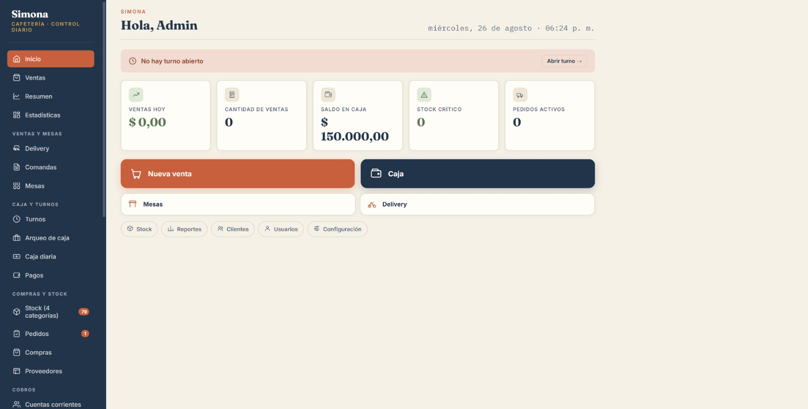
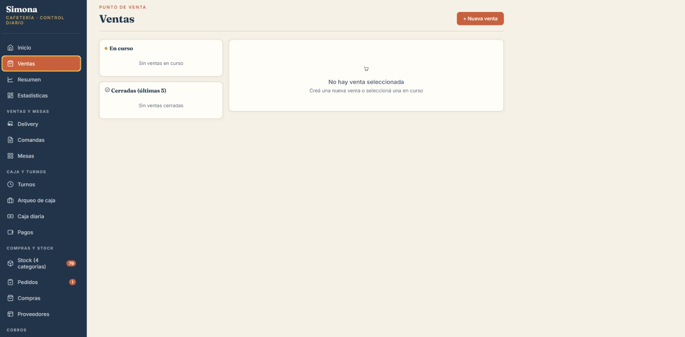
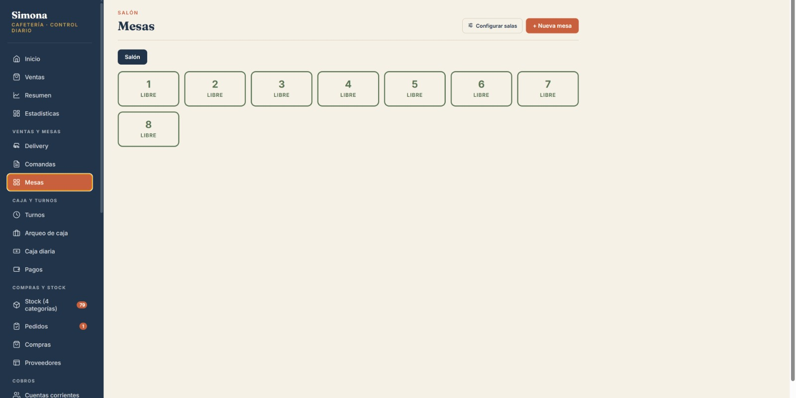
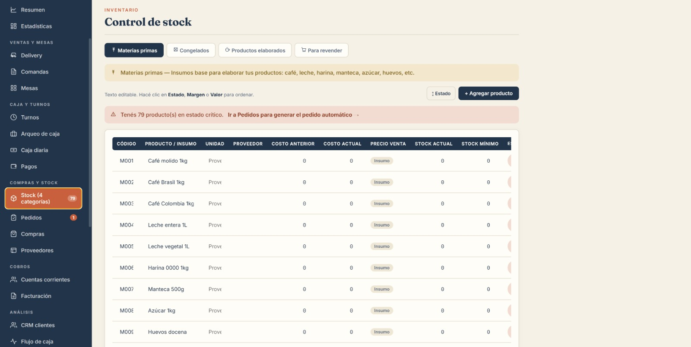

> 🇦🇷 [Leer en español](README.es.md)

# Simona

**Desktop management system for cafés and small food businesses** — point of sale, inventory, production, cash flow and staff shifts in one offline-first Windows app.

Built end-to-end (product decisions, UI, backend logic, deployment) and delivered to a real, paying client currently running it in daily production use.

> 🛠️ **This is not a generic template.** Simona was designed 100% around one specific café — its workflow, its products, its way of counting cash at the end of the day. I build the same kind of custom software for other businesses: if you have a specific workflow that off-the-shelf tools don't fit, [get in touch](#contact) and I'll build something around what you actually need, not the other way around.

> 📌 **This is a portfolio/showcase repository.** The full source code is proprietary and not published here — see [Why the code isn't public](#why-the-code-isnt-public) below. Screenshots, a feature breakdown and the technical stack are below. Happy to walk through the code live or share a private repo on request.

---

## Screenshots

| | |
|---|---|
|  |  |
|  |  |

*Dashboard, point of sale, table management, and inventory. Shown with sample/empty data — no real client information.*

---

## What it does

Simona runs the daily operations of a café: taking orders, tracking what's in stock, costing recipes, closing the register, and telling the owner what needs attention *today* — without needing an internet connection or a subscription.

**Point of sale**
- Fast order entry for counter, tables and delivery
- Per-table order management (Mesas)
- Multiple payment methods, including a live Mercado Pago integration (QR code generation + automatic polling for payment confirmation, and detection of incoming bank transfers)

**Kitchen & production**
- Kitchen display view so the kitchen sees incoming orders in real time, separate from the register
- Recipe-based production: finished products are costed from their ingredients, so margins update automatically as ingredient costs change

**Inventory**
- Full stock control across a live catalog of ~80 products in 4 categories
- Automatic restock alerts ("what should I do today" surfaces exactly what's low)

**Cash & finance**
- Daily cash register open/close (Caja diaria) and formal cash count (Arqueo de caja)
- Accounts payable tracking (Pagos) with due-date based liquidity projection
- Estimated gross margin per period, computed from actual sales minus current ingredient cost — not a static markup
- Monthly revenue targets with progress tracking
- Accounts receivable for customers with a running balance

**Staff & shifts**
- PIN-based shift login, so each staff member's session and actions are separated without full user-account overhead

**Reporting & data ownership**
- Monthly PDF reports
- All data lives in a local JSON file the owner controls directly — one-click backup and restore, no cloud dependency, no vendor lock-in

---

## Why it was built this way

The client needed something that works reliably on a single Windows PC at the counter, doesn't depend on internet uptime, and doesn't come with a recurring subscription for a small, single-location business. That ruled out a typical cloud SaaS approach and shaped most of the technical decisions below.

## Technical stack

- **Electron** — packaged as a native Windows desktop app (NSIS installer), not a browser tab
- **Vanilla JavaScript** UI, no framework overhead — kept the app fast and the dependency surface small
- **Node.js** main process handling file I/O, silent printing, and IPC with a locked-down renderer (`contextIsolation` on, `nodeIntegration` off)
- **electron-store** for local persistence (last-opened file, settings, Mercado Pago credentials)
- **electron-builder** for the signed Windows installer and update packaging
- **Mercado Pago API** integration for QR payments and transfer detection
- Local **JSON** as the data layer, with backup/restore built into the UI — the client owns their data as a file, not as a row in someone else's database

## Why the code isn't public

Simona was built and delivered as commercial software for a specific paying client, under an ongoing business relationship (Celfar) — not as an open-source project. Publishing the full source would give away a working product for free and isn't something I can do without the client's and business's agreement.

This repository exists so the work is verifiable: real screenshots, an honest feature list, and a straight account of the technical decisions behind it. If you want to see the code itself — for a job application, a technical interview, or a contracting evaluation — reach out and I'll walk through it live or share access privately.

## Contact

**Juan Farias** — juanfarias8213@gmail.com

---

© 2026 Celfar. All rights reserved. See [LICENSE](LICENSE).
